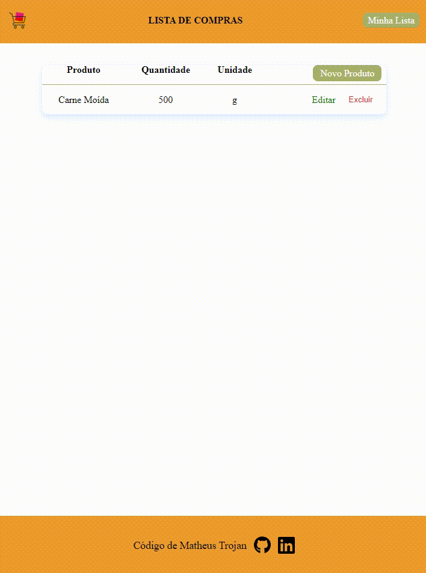

# Lista do Mercado 

<p>Um aplicativo para criar e editar sua lista de mercado de forma simples e rápida!</p>

## Conteúdo deste Readme:

- [Resumo](#resumo)
  - [O Desafio](#o-desafio)
  - [Screenshot](#screenshot)
  - [Preview](#preview)
  - [Como Utilizar](#como-utilizar)
- [Meu processo](#meu-processo)
  - [Projetado com](#projetado-com)
  - [O que eu aprendi](#o-que-eu-aprendi)
- [Autores](#autores)

## Resumo

### O Desafio

O objetivo do aplicativo é de ser intuitivo e de fácil manutenção. Seguindo a linha minimalista, o design é simples, onde o usuário pode adicionar, remover ou editar itens em uma lista de compras de mercado. O aplicativo exibe as informações em uma tabela que pode ser incrementada com nome do produto, quantidade e unidade de medida. 

O usuário deverá conseguir:

- Preencher os campos do formulário de adição de produtos;
- Conseguir excluir produtos da lista;
- Conseguir acessar os dados e editá-los após clicar no botão "Editar";
- Percorrer a lista de compras com todas mudanças realizadas;

### Screenshot


### Preview



### Como Utilizar

```
🟢 npm install;
🟢 npx json-server --watch db.json;
```

## Processo de Criação

### Projetado com

- HTML5 semântico
- Propriedades CSS
- Flexbox
- Funções JavaScript
- Consumo de uma "fake" API
- CRUD - (Creade, read, uptade, delete)
- Responsividade para todas as telas

### O que eu aprendi

🟢 Criar um arquivo Json para adicionar e ler informações; <br>
🟢 Meu primeiro sistema CRUD;  <br>

## Autor

- [Matheus Trojan](https://www.linkedin.com/in/matheus-trojan/)
